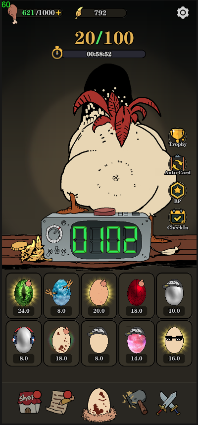
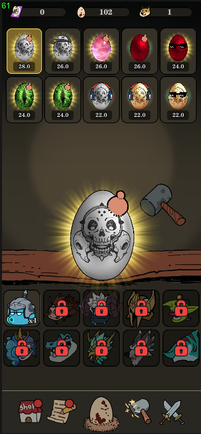
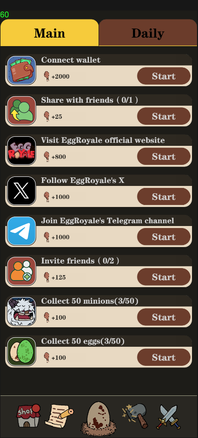
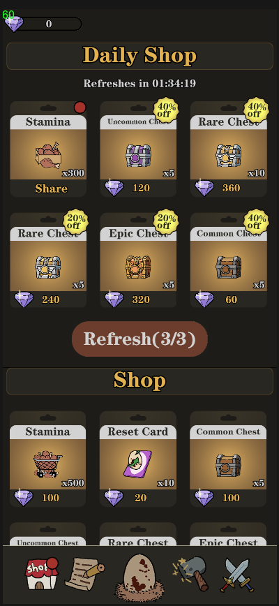
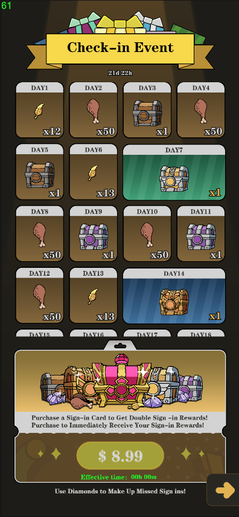
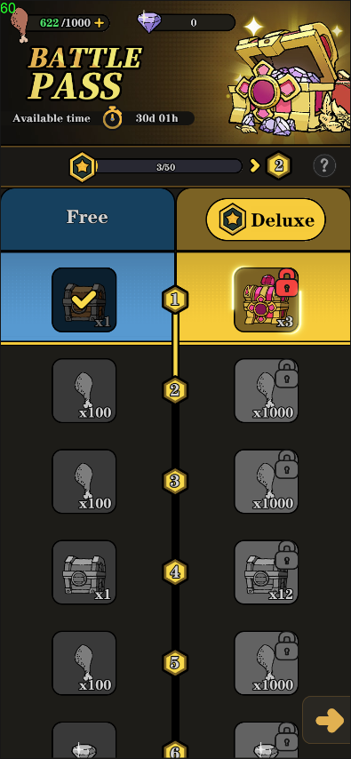
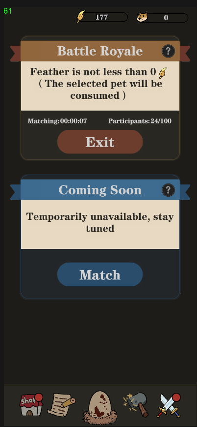
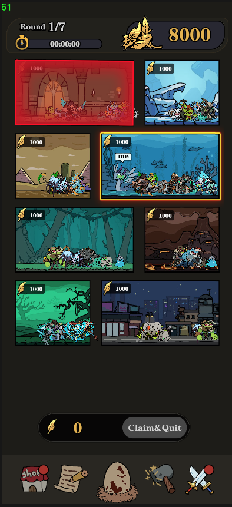

# eggserver百人大逃杀游戏服务器

## 客户端：https://github.com/dot123/eggroyale

## 项目概述
EggServer 是一个基于 Go 语言开发的高性能服务器项目，采用现代化的技术栈和架构设计。

## 1. 核心技术
- **编程语言**: Go (版本 1.22.5)
  - 高性能、并发友好的编程语言
  - 丰富的标准库和工具链
- **Web框架**: Gin (gin-gonic/gin)
  - 高性能 HTTP Web 框架
  - 优秀的路由性能和中间件支持
- **数据库**: 
  - MySQL (gorm.io/driver/mysql)
    - 主要数据持久化存储
    - 通过 GORM 实现 ORM 映射
  - Redis (redis/go-redis/v9)
    - 缓存和数据共享
    - 分布式锁实现

## 2. 主要框架和库

### 2.1 Web相关
- Gin Web框架
  - RESTful API 支持
  - 中间件机制
- CORS中间件 (gin-contrib/cors)
  - 跨域资源共享支持
- Swagger文档 (swaggo/gin-swagger)
  - API 文档自动生成
  - 接口测试支持

### 2.2 数据库和缓存
- GORM ORM框架
  - 数据库模型映射
  - 自动迁移支持
- Redis 缓存
  - 高性能数据缓存
  - 分布式数据共享
- Redis分布式锁 (go-redsync)
  - 分布式环境下的同步控制
- 内存缓存 (go-cache)
  - 本地缓存支持

### 2.3 认证和安全
- JWT认证 (golang-jwt/jwt/v5)
  - 用户身份验证
  - 无状态会话管理
- 速率限制 (redis_rate)
  - API 访问控制
  - 防止恶意请求

### 2.4 工具库
- Snowflake ID生成器
  - 分布式环境下的唯一ID生成
- Logrus日志系统
  - 结构化日志记录
- 文件轮转日志 (file-rotatelogs)
  - 日志文件管理
- MessagePack序列化 (msgpack)
  - 高效的数据序列化
- 错误处理 (pkg/errors)
  - 统一的错误处理机制

## 3. 项目架构特点

### 3.1 目录结构
```
├── cmd/            # 主程序入口
├── internal/       # 内部包
│   ├── config/     # 配置管理
│   ├── handler/    # HTTP请求处理
│   ├── logic/      # 业务逻辑实现
│   ├── middleware/ # 中间件组件
│   └── models/     # 数据模型定义
├── pkg/            # 公共功能包
├── tools/          # 开发工具集
└── docs/           # API 文档
```

### 3.2 设计模式
- 三层架构模式
  - Model: 数据模型层，处理数据持久化
  - Handler: 请求处理层，负责HTTP请求的处理和路由
  - Logic: 业务逻辑层，实现核心业务逻辑
- 中间件模式
  - 灵活的请求处理链
  - 可插拔的功能模块
- Repository模式
  - 数据访问层抽象
  - 便于切换数据源

## 4. 开发和部署

### 4.1 开发工具和命令
- `./install dependencies.cmd`
  - 安装项目依赖工具包
- `./build_swag.cmd`
  - 生成 API 接口文档
- `./configs_gen.cmd`
  - 使用 luban 导出配置表数据
- `./robot/run.cmd`
  - 性能压测工具
- `./tools/error-gen/build.cmd`
  - 生成错误码文件
- `./data/conf/`
  - MySQL、Redis 等配置信息

### 4.2 部署和运维
- `./build.sh`
  - 打包项目为 bin.zip
- AWS Lambda 支持
  - 实现服务高可用
  - 弹性伸缩能力

## 5. 客户端截图
### 主界面


### 宠物界面


### 任务界面


### 商店界面


### 签到界面


### 战令界面


### 匹配界面


### 战斗界面

